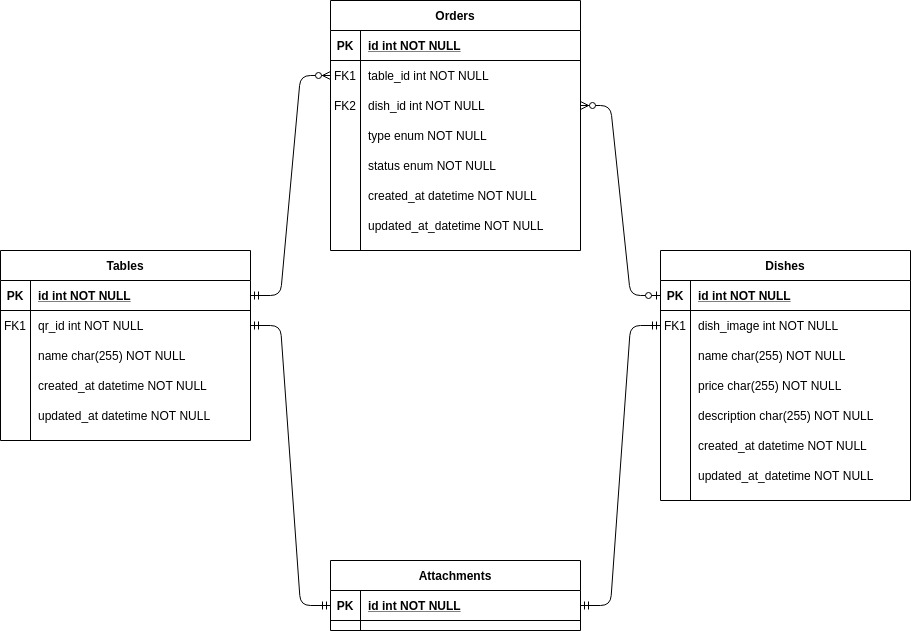

# Restaurants QR orders

Allows restaurants to manage orders through unique QR codes for each table. 

## Dependencies

* Ruby version 3.0.2

* Rails version 6.1.4

* Postgresql version 12

## Entity relationship diagram
